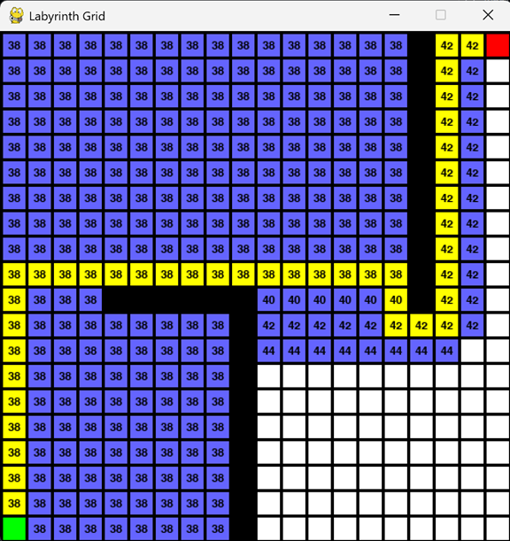
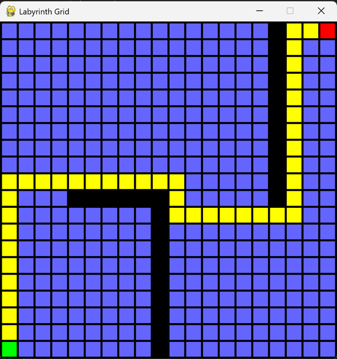

# 🧭 Pathfinding Algorithm Projects

This repository contains two algorithmic pathfinding assignments implemented in Python.

## 📁 Contents

### 1.[Graph Search on Romania Map (`BFS_DFS_UCS.py`)](#)
Implements classic graph search algorithms on a simplified Romania map.

- Language: Python
- Algorithms: BFS, DFS, UCS
- Output: CLI text output

### 2. [Grid-based A* and BFS Visualizer (`Astar_algorithm.py`)](#)
Visualized grid-based path planning using Pygame.

- Language: Python + Pygame
- Algorithms: A*, BFS
- Output: Visual animation with dynamic path drawing

## 📦 Installation

```bash
##for BFS_DFS_UCS.py
pip install pygame prettytables

##for Astar_algorithm.py
pip install pygame
```

## 📘 Output
```bash
##for BFS_DFS_UCS.py(Bu->Ti)
UCS path: ['Bu', 'Ur', 'Va', 'Ia', 'Ne', 'Ze', 'Ar', 'Ti']
UCS cost: 646
BFS path: ['Bu', 'Fa', 'Si', 'Ri', 'Pi', 'Cr', 'Dr', 'Me', 'Lu', 'Ti']
BFScost: 758
DFS path: ['Bu', 'Fa', 'Si', 'Ar', 'Ti']
DFS cost: 469
```

## 📸 Demo Screenshots

### A* Pathfinding Animation
<p float="left">
  
</p>

### BFS on Grid
<p float="left">
  
</p>


